# Replication crisis

## A crisis in psychology

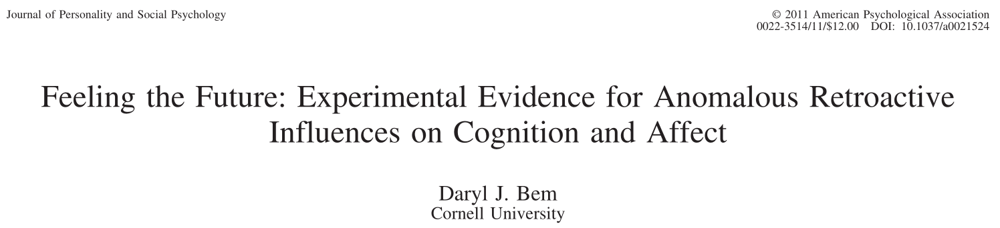{.absolute top=150 left=-100 width="600" fig-alt="Manuscript info for Bem 2011 Feeling the Future: Experimental Evidence for Anomalous Retroactive Influences on Cognition and Affect"}

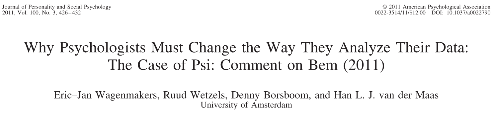{.absolute top=150 left=550 width="600" fig-alt="Manuscript info for Wagenmakers et al. 2011 Why Psychologists Must Change the Way They Analyze Their Data: The Case of Psi: Comment on Bem (2011)"}

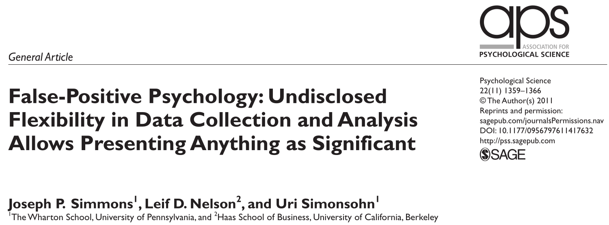{.absolute top=350 left=225 width="600" .fragment fig-alt="Manuscript info for Simmons et al. 2011 False-Positive Psychology: Undisclosed Flexibility in Data Collection and Analysis Allows Presenting Anything as Significant"}

## Replication in psychology

](media/replication.jpg){fig-align="center" fig-alt="Colored boxes showing number of replication studies whose outcomes matched the original's results. 39 studies matched and 61 studies did not. Colors represent the degree to which the replication results were similar to the original results."}

## Causes of the crisis

* Small sample sizes
* Optional stopping
* Poor understanding and use of statistics
* P-hacking
* HARKing
* Inconsistency in methods
* Bias against replications
* WEIRD populations

## A push for more reliable research

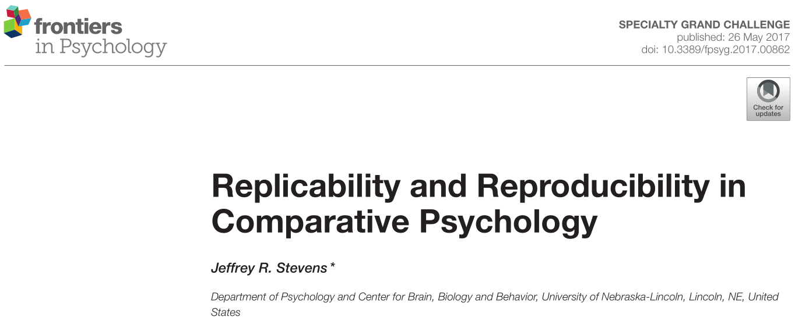{.absolute top=150 left=25 width="1000" fig-alt="Manuscript info for Stevens 2017: Replicability and Reproducibility in Comparative Psychology."}


## Canine Cognition and Human Interaction Lab

{height="345" fig-alt="Brown dog approaching cup on floor with researcher in background."}
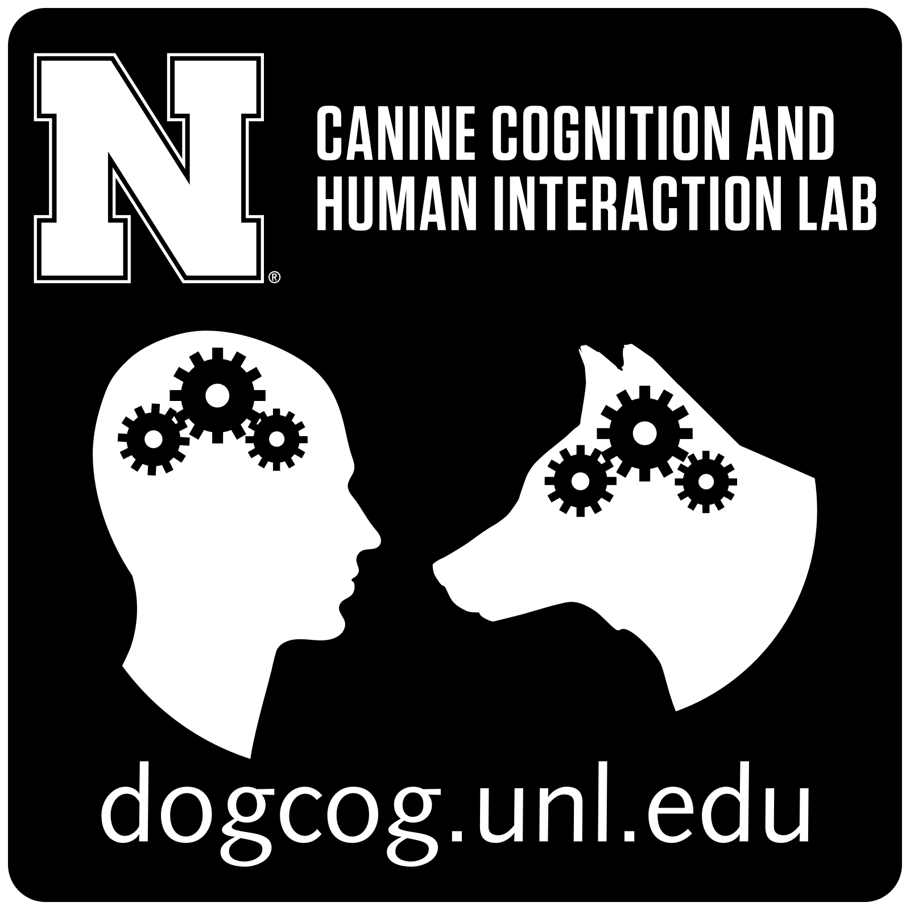{height="340" fig-alt="Logo for Canine Cognition and Human Interaction Lab"}
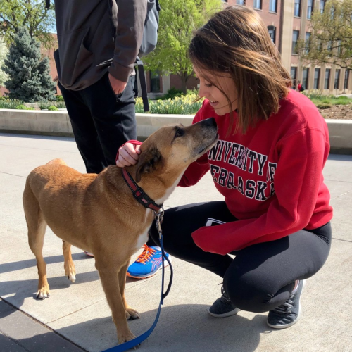{height="345" fig-alt="Brown dog being petted by undergraduate student."}

{.absolute top=420 left=400 width="250" fig-alt="Black sign reading Established 2018."}


# Replicating methods

## Dog impulsivity

:::{.fragment}
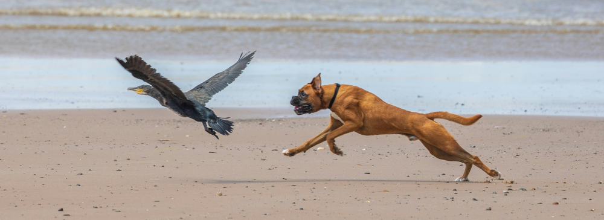{.absolute top="8%" left="14%" height="300" fig-alt="Brown dog chasing cormorant on the beach."}

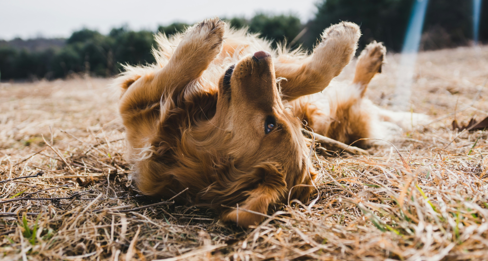{.absolute top="51%" left="0%" height="300" fig-alt="Brown dog rolling around on grass."}

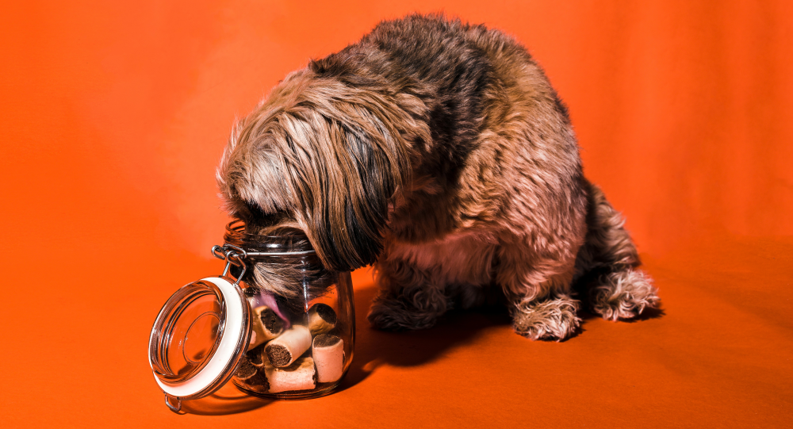{.absolute top="51%" left="53%" height="300" fig-alt="Brown dog licking treats in a jar."}

::: {.source}
Photos by: [Pete Godfrey](https://unsplash.com/photos/a-dog-chasing-a-bird-on-the-beach-4mJccBXMZo4), [Michael Oxendine](https://unsplash.com/photos/adult-gold-golden-retriever-lying-on-floor-t7wwffh6x8E), [Tamas Pap](https://unsplash.com/photos/brown-and-black-long-coated-small-dog-AMRVK6UINy8) on Unsplash
:::
:::


## Owner perceptions of dog impulsivity

::: {.callout-tip}
## Research Question

<!-- ::: {.fragment} -->

::: {style="font-size: 40px"}
**Do owner perceptions of dog impulsivity match impulsivity in a behavioral task?**
:::
<!-- ::: -->
:::

::: {.fragment}
Replicated [Brady et al., 2018](https://doi.org/10.1016/j.applanim.2018.01.003)
:::

::: {.source}
[Stevens et al. 2022, _Animal Behavior & Cognition_](https://doi.org/10.26451/abc.09.03.02.2022)
:::


## Measuring owner perceptions

### Dog Impulsivity Assessment Scale (DIAS)

::: {.fragment}
 * I would consider my dog to be very impulsive
 * My dog does not think before it acts
 * My dog appears to have a lot of control over how it responds
 * My dog is not very patient

[Wright et al., 2011](https://doi.org/10.46867/ijcp.2011.24.02.03)

:::

::: {.source}
[Stevens et al. 2022, _Animal Behavior & Cognition_](https://doi.org/10.26451/abc.09.03.02.2022)
:::


## Measuring spatial impulsivity

<!-- ::: {.r-stack} -->
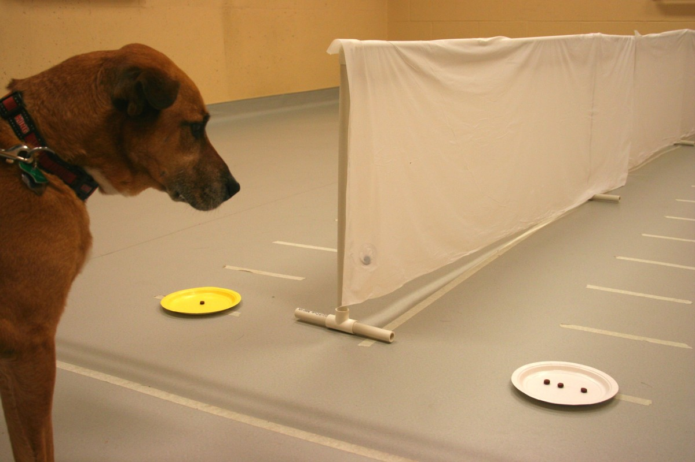{height="490" fig-align="center" fig-align="center" fig-alt="Brown dog looking at plate of three treats next to plate of one treat."}

<!-- 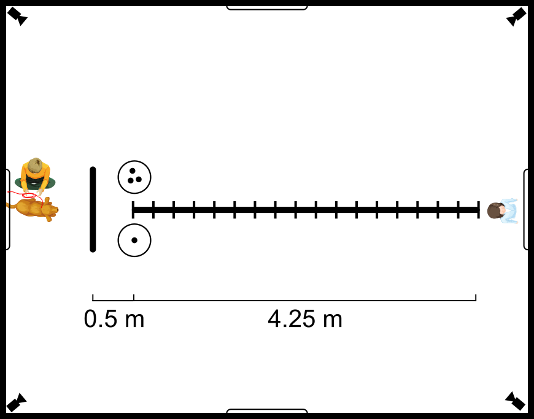{.fragment height="580" fig-align="center" fig-alt="Illustration of experimental set-up with dog and handler at one end near the curtain, with plates of treats on other side of curtain and experimenter at far end."} -->
<!-- ::: -->

::: {.source}
[Stevens et al. 2022, _Animal Behavior & Cognition_](https://doi.org/10.26451/abc.09.03.02.2022)
:::


## Original results

::: {.r-stack}
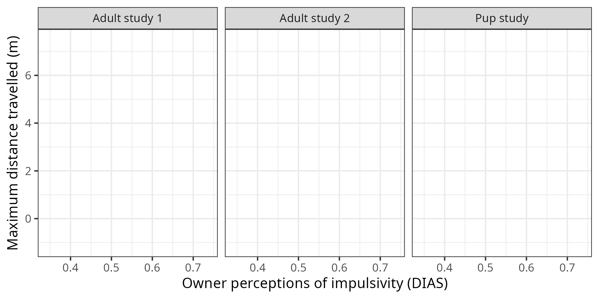{fig-align="center" fig-alt="Three panel plot of Maximum Distance Traveled (in meters) as a function of Owner Perceptions of Impulsivity (DIAS) for Adult Study 1, Adult Study 2, and Pup Study. There are no data."}

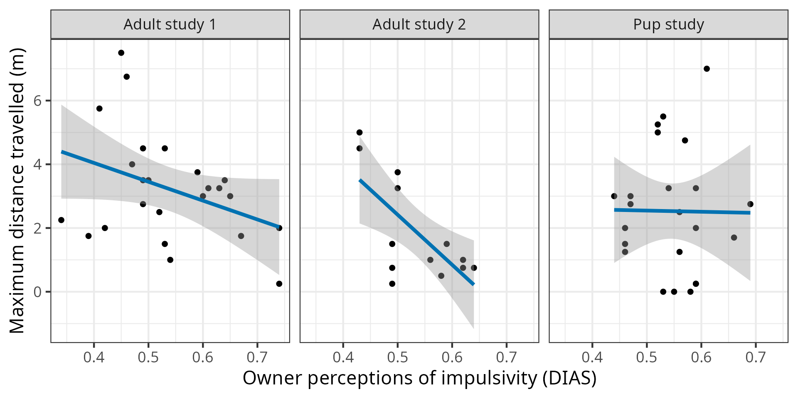{fig-align="center" .fragment fig-alt="Three panel plot of Maximum Distance Traveled (in meters) as a function of Owner Perceptions of Impulsivity (DIAS) for Adult Study 1, Adult Study 2, and Pup Study. Data show a negative relationship for Adulty Study 1 and 2 but no relationship for Pup Study."}
:::

::: {.source}
[Brady et al. 2018, _Applied Anim Behav Sci_](https://doi.org/10.1016/j.applanim.2018.01.003)
:::


## Our results

::: {.r-stack}
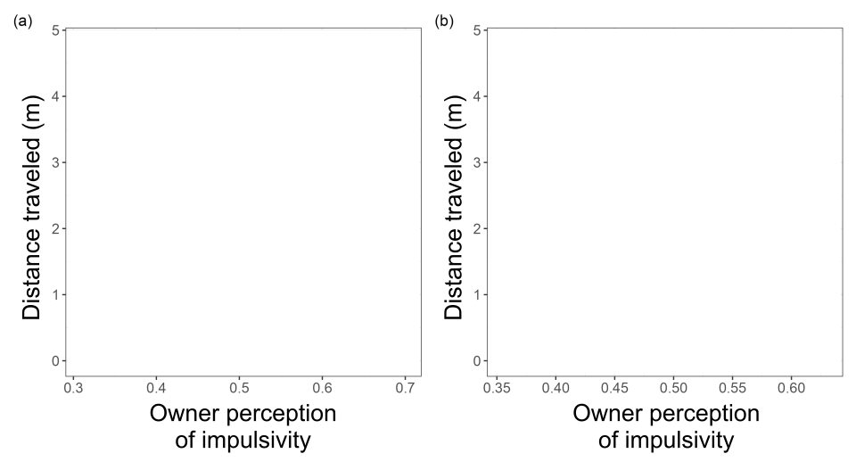{height="550" fig-align="center" fig-alt="Scatterplot of Distance traveled (in meters) as a function of Owner Perception of Impulsivity. There are no data."}

::: {data-id="box1" style="background: #132E53; width: 500px; height: 600px; margin: 10px; position: absolute; top: 50px; left: 515px"}
:::

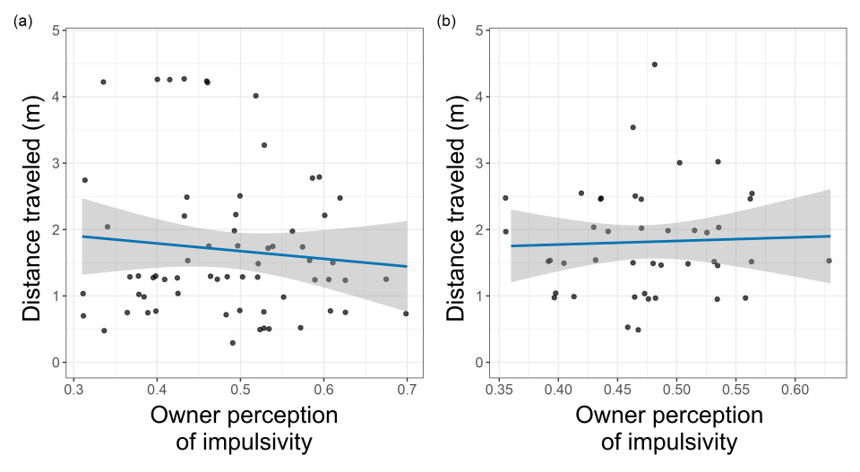{.fragment height="550" fig-align="center" fig-alt="Scatterplot of Distance traveled (in meters) as a function of Owner Perception of Impulsivity. Data show no relationship."}

::: {data-id="box1" style="background: #132E53; width: 500px; height: 600px; margin: 10px; position: absolute; top: 50px; left: 515px"}
:::

{.fragment height="550" fig-align="center" fig-alt="Two scatterplots of Distance traveled (in meters) as a function of Owner Perception of Impulsivity. Data show no relationship in both plots."}

:::

::: {.source}
[Stevens et al. 2022, _Animal Behavior & Cognition_](https://doi.org/10.26451/abc.09.03.02.2022)
:::


## Owners not good at predicting dog impulsivity {.center}


## Conclusions

Did not replicate Brady et al., 2018

::: {.incremental}
* British know their dogs better than Nebraskans?
* Different owner populations?
  - British vs. American dog-owner bonds
  - Demographics
* Different dog populations?
  - Breeds
  - Neuter status
:::


## Implications for reliability

::: {.incremental}
* Increase sample sizes
* Conduct more replications (within and between labs)
* Increase robustness and reproducibility of analyses
* Post data publicly
* Provide more and consistent info on owners
* Consider populations of owners and dogs
:::


# Aggregating studies

## Impulsivity as a trait in domestic dogs

::: {.callout-tip}
## Research Question

::: {style="font-size: 40px"}
::: {.fragment}
**Is impulsivity a behavioral trait in dogs?**
:::
::: {.fragment}
* Do dogs' impulsivity levels correlate across tasks?
* Do dogs' impulsivity levels correlate with owner perceptions?
:::
:::
:::

::: {.source}
[Barela et al. 2024, _Journal of Comparative Psychology_](https://doi.org/10.1037/com0000352)
:::


## Meta-analysis

:::{.incremental}
* Systematic review of the literature to extract and compare statistics from all published studies
* Searched 9,900 records from Scopus, Web of Science, and PsychINFO 
* 13 articles conducted correlations between impulsivity tasks and/or between the Dog Impulsivity Assessment Scale (DIAS) and behavioral tasks
:::

::: {.source}
[Barela et al. 2024, _Journal of Comparative Psychology_](https://doi.org/10.1037/com0000352)
:::


## Task examples

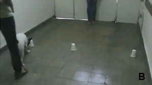{.absolute top="10%" left="5%" height="250"}
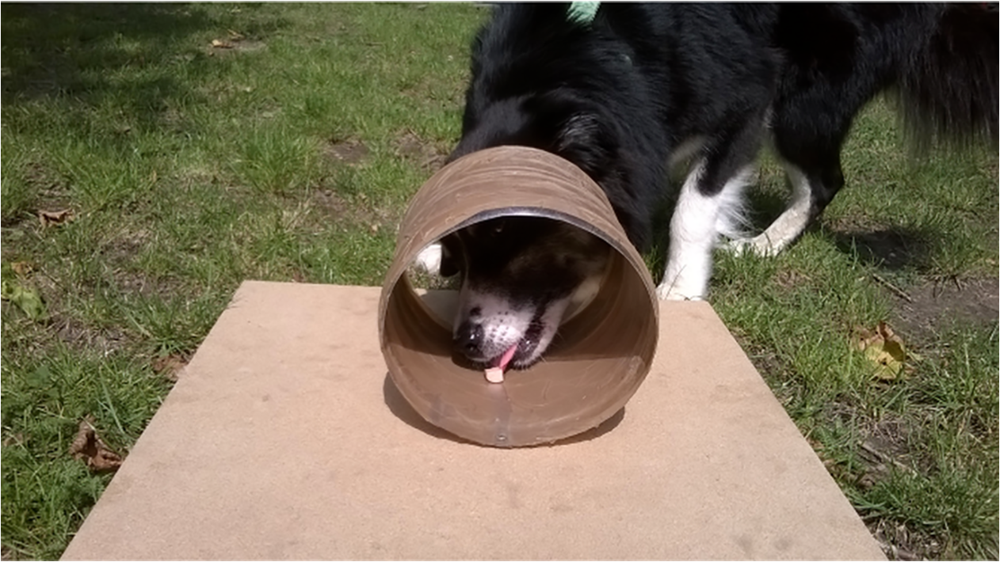{.fragment .absolute top="50%" left="5%" height="250"}
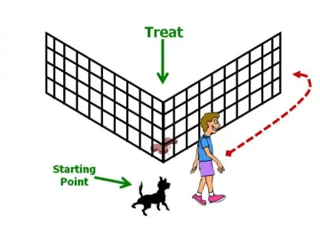{.fragment .absolute top="10%" left="50%" height="250"}

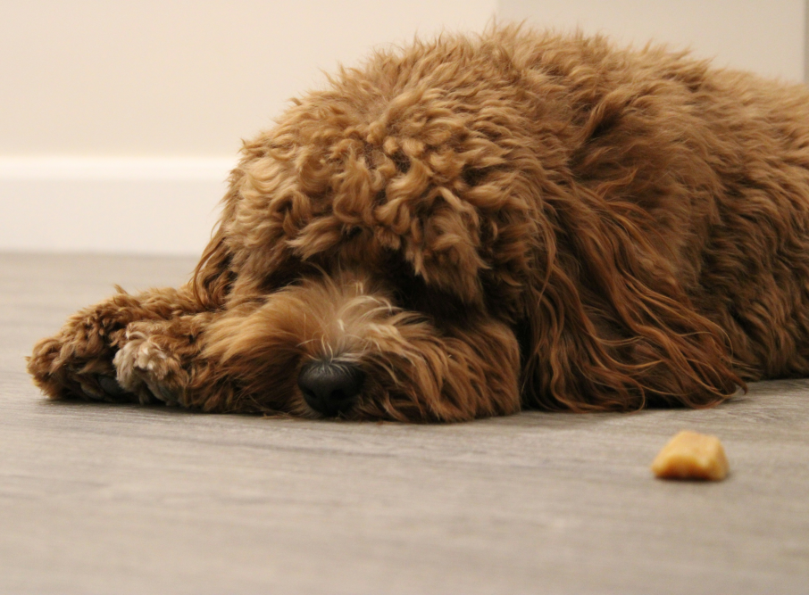{.fragment .absolute top="50%" left="50%" height="250"}

::: {.source}
[Barela et al. 2024, _Journal of Comparative Psychology_](https://doi.org/10.1037/com0000352)
:::


## Systematic review: task pairs

::: {.r-stack}
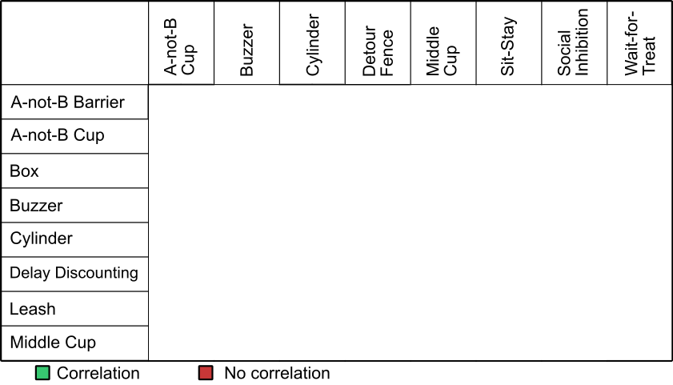{.fragment height="500" fig-align="center"}

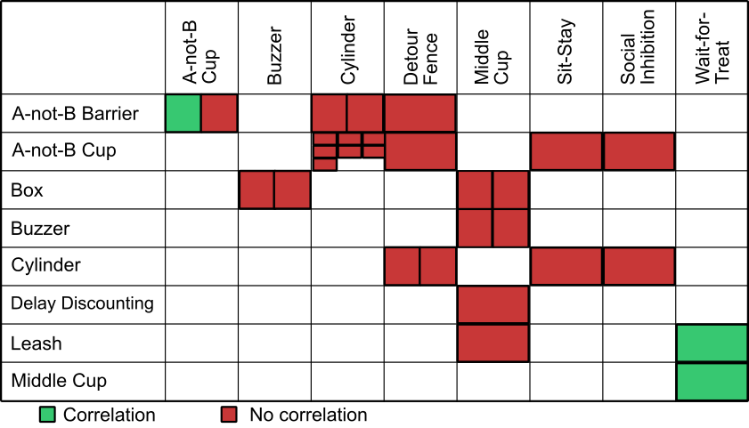{.fragment height="500" fig-align="center" .fragment}
:::

::: {.source}
[Barela et al. 2024, _Journal of Comparative Psychology_](https://doi.org/10.1037/com0000352)
:::


## Systematic review: DIAS and tasks

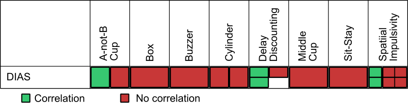{.fragment height="250" fig-align="center"}

::: {.source}
[Barela et al. 2024, _Journal of Comparative Psychology_](https://doi.org/10.1037/com0000352)
:::


## Impulsivity does not seem to be a behavioral trait {.center}


## Implications for reliability

::: {.incremental}
* Enhance statistical power
* Gives larger picture of effects
* Help resolve conflicting results
* Reduces biases toward positive effects
:::


# Big team science

## What is big team science?

> Collaborations wherein a comparatively large number of researchers pool their intellectual and/or material resources to pursue a common goal

---Baumgartner et al., 2023 _Royal Society Open Science_.

::: {.fragment}
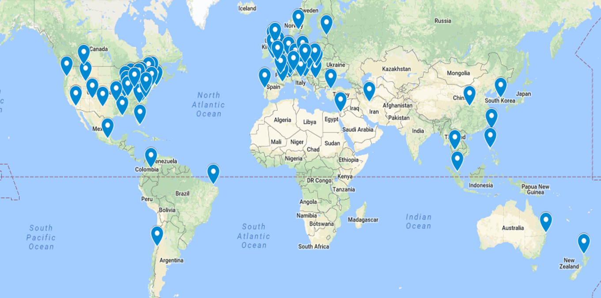{fig-align="center" fig-alt="World map with pins showing locations of Psychological Science Accelerator research sites."}
:::


## ManyDogs Project

International research consortium of scientists with shared interest in canine behavior and cognition

::: {.r-stack}
](media/manydogs_banner.jpg){width="800" fig-alt="ManyDogs logo"}

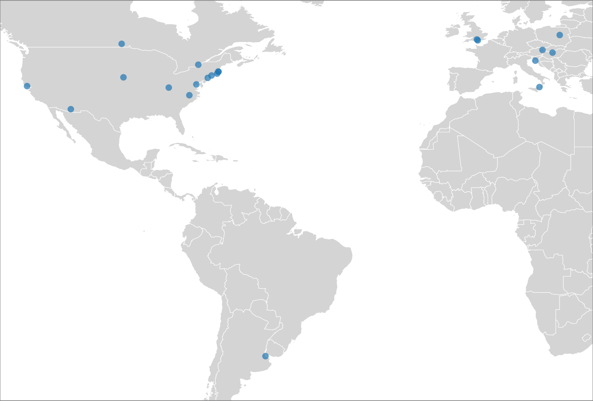{.fragment width="850" fig-alt="World map with pins showing locations of ManyDogs Project research sites"}
:::


## ManyDogs 1

::: {.callout-tip}
## Research Question

::: {style="font-size: 40px"}
::: {.fragment}
**Do dogs treat human pointing as communicative cues?**
:::
:::
:::

::: {.fragment}
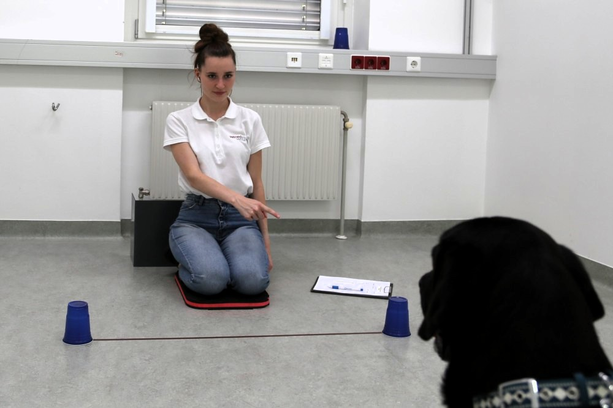{fig-align="center" width="550" fig-alt="Black dog watching experimenter point to one of two blue cups."}
:::

::: {.source}
[ManyDogs Project et al. 2023, _Animal Behavior & Cognition_](https://doi.org/10.26451/abc.10.03.03.2023)
:::


## Dogs follow the point

::: {.r-stack}
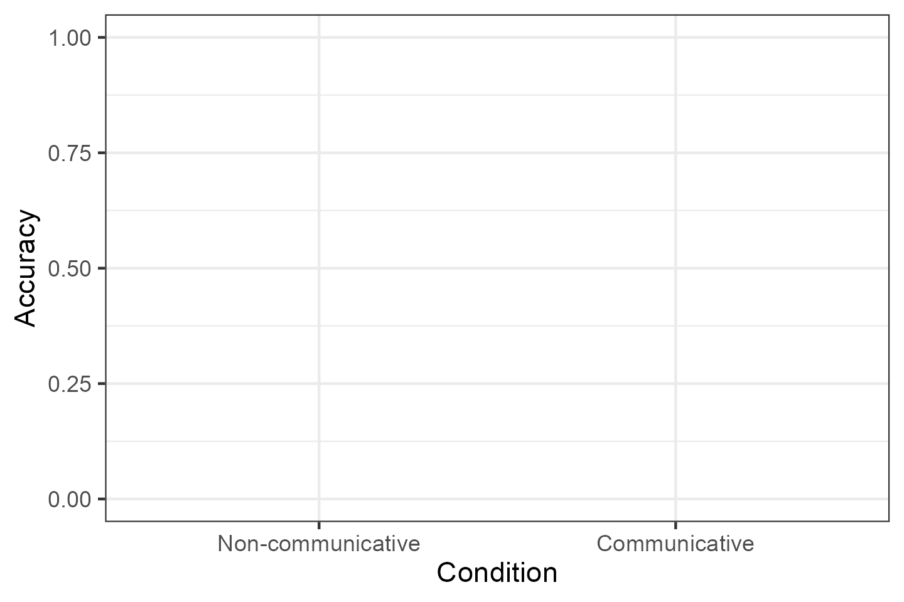{fig-align="center" height="550" fig-alt="Plot of Accuracy as a function of Condition (Non-communicative and Communicative). There are no data."}

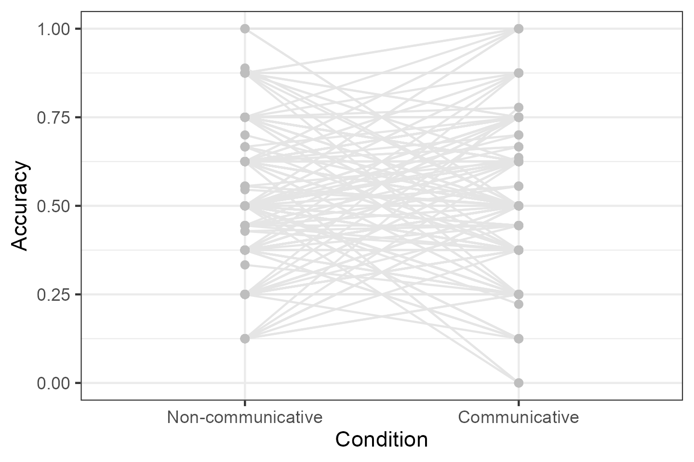{fig-align="center" height="550" .fragment fig-alt="Spaghetti plot of Accuracy as a function of Condition (Non-communicative and Communicative). Data show no discernable pattern."}

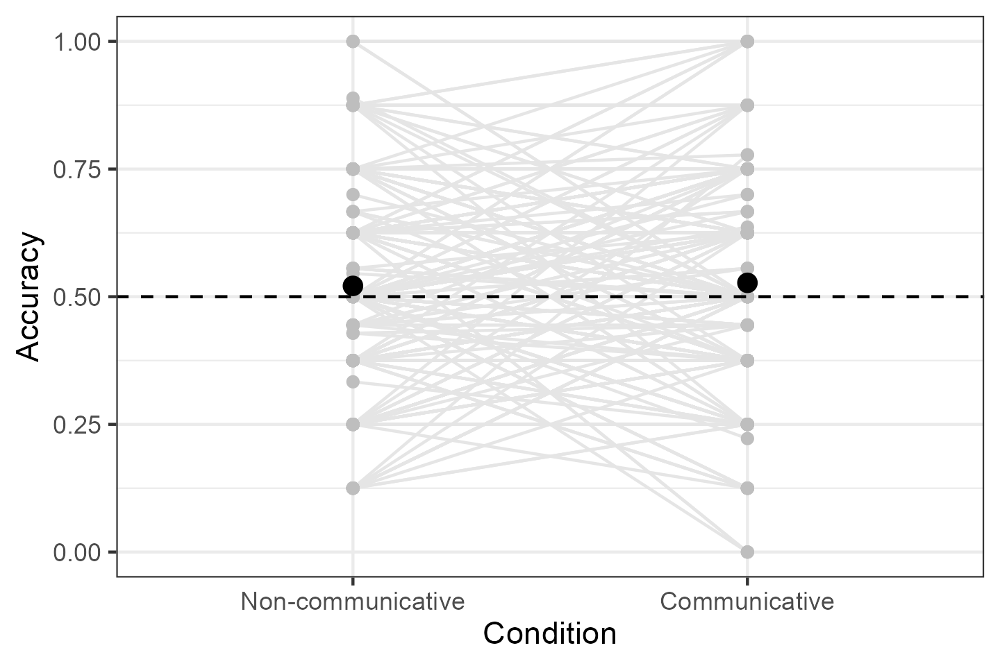{fig-align="center" height="550" .fragment fig-alt="Spaghetti plot of Accuracy as a function of Condition (Non-communicative and Communicative) with group means and 95% confidence intervals overlaid. Means are slightly greater than chance (0.5) but not different from each other."}
:::

::: {.source}
[ManyDogs Project et al. 2023, _Animal Behavior & Cognition_](https://doi.org/10.26451/abc.10.03.03.2023)
:::


## Sites differ in owner age distribution

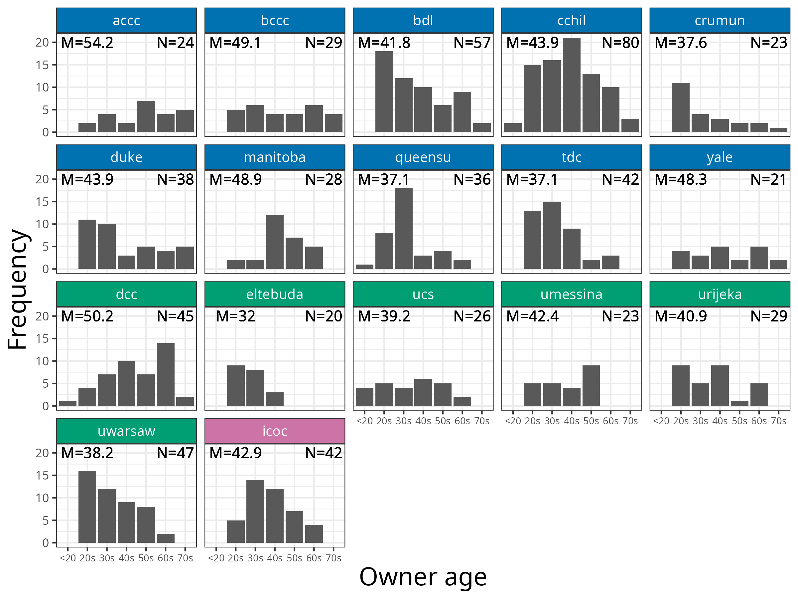{fig-align="center" height="550" fig-alt="Panel of 17 histograms (one for each research site) showing frequency of participant owner ages across sites. Sites show marked variation with some uniformly distributed, some normally distributed, and some skewed to younger ages."}

::: {.source}
[ManyDogs Project et al. 2023, _Animal Behavior & Cognition_](https://doi.org/10.26451/abc.10.03.03.2023)
:::


## Dogs followed pointing but not communicatively {.center}


## Implications for reliability
::: {.incremental}
* Again, consider populations of owners and dogs
* Many analysts improved analysis
* Consider multi-site replication
:::


# Lessons Learned

## Reliable science

::: {.fragment}
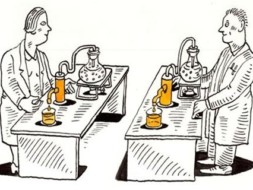{.absolute height=250 top="10%" left="5%" fig-alt="Illustration of two scientists replicating each other's chemistry experiment."}

::: {.absolute height=250 top="45%" left="13%"}
Replicable 
:::
:::

::: {.fragment}
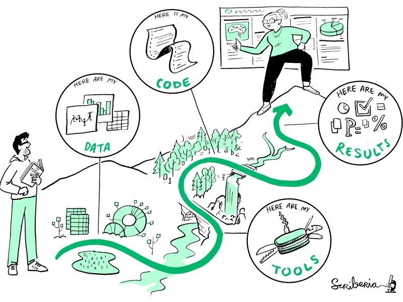{.absolute height=250 width=350 top="10%" left="55%" fig-alt="Illustration of person walking through windy trail of reproduciblity, including data, tools, code, and results."}

::: {.absolute height=250 top="45%" left="61%"}
Reproducible
:::
:::

::: {.fragment}
{.absolute height=250 top="55%" left="5%" fig-alt="Illustration of large global network with people all over the world connected to one another."}

::: {.absolute height=250 top="90%" left="15%"}
Robust 
:::
:::

::: {.fragment}
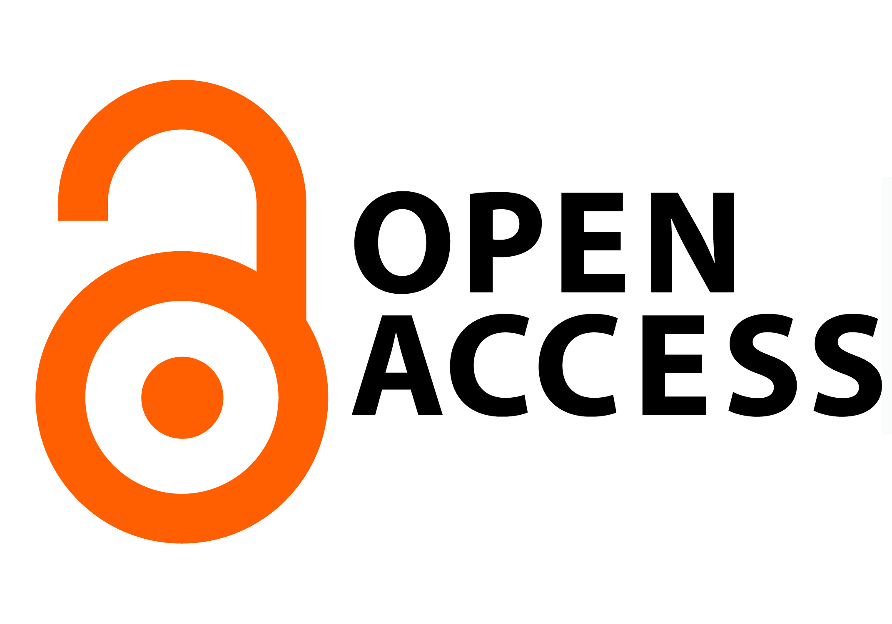{.absolute height=250 width=350 top="55%" left="55%" fig-alt="Open access logo"}

::: {.absolute height=250 top="90%" left="67%"}
Open
:::
:::


## What can you do?

::: {.incremental}
* Develop an [open science mindset](https://doi.org/10.1080/21642850.2021.2012474)
* Read articles about [easing into open science](https://doi.org/10.1525/collabra.18684)
* Propose to conduct replications or [meta-analysis](https://doi.org/10.1037/met0000351)
* Join the [Society for the Improvement of Psychological Science](https://improvingpsych.org/)
* Join a [big team science team](https://manydogsproject.github.io/getinvolved.html#other-big-team-science-groups)
* Learn R and/or Python
:::

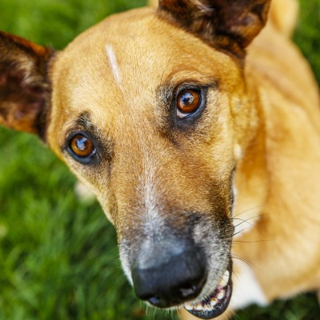{.absolute left=650 top=400 height=300 fig-alt="Close-up image of brown dog's face."}


## Thank you!

:::: {.columns}
::: {.column}
**Research assistants**

* Jessica Barela
* Megan Herridge
* Kylie Hughes-Duvall
* Maddie Mathias
* London Wolff
* Yasmin Worth
* McKenna Yohe
:::
::: {.column}
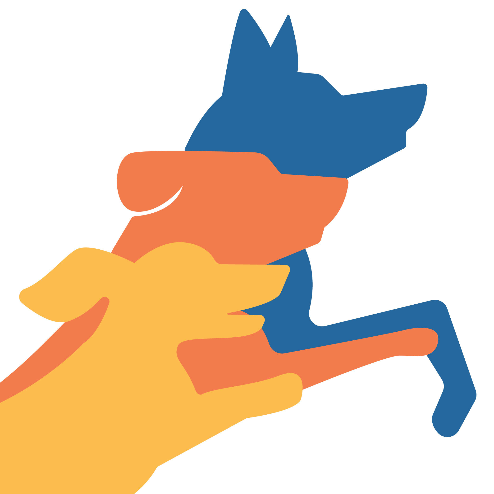{fig-align="center" height=250 fig-alt="ManyDogs logo"}
{fig-align="center" height=250 fig-alt="National Science Foundation logo"}
:::
::::


## Contact

```{r}
library(icons)
```

 `jstevens5@unl.edu`

 `jeffreyrstevens.quarto.pub/nps2025`

::: {style="font-size: 0.5em"}
<br>
:::

**Canine Cognition and Human Interaction Lab**

 `dogcog.unl.edu`

 `unl_cchil`

 `unl.cchil`

 `@unlcchil.bsky.social`

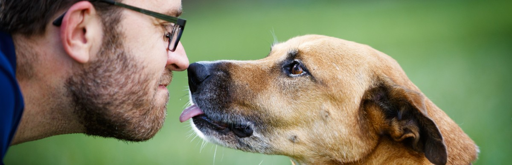{.absolute top="45%" left="50%" height="280"}

::: {style="font-size: 0.5em"}
<br>
:::

